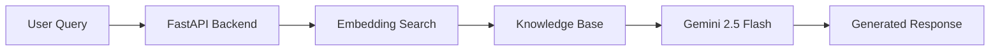

<div align="center">

# 🤖 Recimotech Enterprise RAG AI Agent

### Enterprise Retrieval-Augmented Generation (RAG) Conversational AI Platform

*An enterprise-grade conversational AI system that combines semantic search, contextual retrieval, session memory, and large language models to deliver intelligent, context-aware responses from an organization's unstructured knowledge base.*


</div>

---

# 📖 Overview

Modern organizations generate vast amounts of unstructured information spread across documents, manuals, FAQs, policies, and internal knowledge bases. Traditional chatbots relying on predefined responses often struggle to provide accurate, context-aware answers.

The **Recimotech Enterprise RAG AI Agent** leverages Retrieval-Augmented Generation (RAG) to retrieve relevant organizational knowledge and synthesize responses using Google's **Gemini 2.5 Flash** Large Language Model.

The system combines semantic search, conversational memory, and intelligent retrieval to create a scalable enterprise AI assistant capable of supporting employees and customers through natural, multi-turn conversations.

---

# ✨ Key Features

## 🧠 Retrieval-Augmented Generation (RAG)

Instead of relying on static FAQs, the system:

- Retrieves relevant knowledge dynamically
- Generates context-aware responses
- Synthesizes information from multiple sources
- Minimizes hallucinations through grounded retrieval

---

## 💬 Stateful Conversation Memory

Maintains conversational context across multiple interactions.

Capabilities include:

- Multi-turn conversations
- Context retention
- Pronoun resolution
- Follow-up question understanding
- Session-aware responses

---

## 📄 Dynamic Knowledge Base

Knowledge is completely separated from application logic.

Features include:

- Automatic document loading
- Runtime embedding generation
- Easy knowledge updates
- Scalable document management

---

## 🔍 Semantic Search Engine

Uses sentence embeddings and cosine similarity to retrieve the most relevant information.

Includes:

- Vector embeddings
- Semantic similarity search
- Context ranking
- Efficient document retrieval

---

## 🎯 Intelligent Lead Routing

Designed to identify transactional intent and customer interest.

Supports:

- Lead qualification
- User information collection
- Intent detection
- Business workflow integration

---

# 🏗 System Architecture



---

# 🚀 Engineering Highlights

### ✔ Enterprise Retrieval Pipeline

Retrieves only the most relevant knowledge before invoking the language model, improving response quality and reducing hallucinations.

---

### ✔ Semantic Vector Search

Utilizes Sentence Transformers and cosine similarity for intelligent document retrieval.

---

### ✔ Session Memory

Maintains conversational continuity, enabling users to ask natural follow-up questions without repeating previous context.

---

### ✔ Modular Knowledge Management

Knowledge assets are stored independently from application logic, allowing updates without modifying source code.

---

### ✔ Scalable API Design

Built using FastAPI with a modular architecture suitable for production-ready deployment.

---

# 🛠 Technologies Used

| Layer | Technology |
|---------|------------|
| Backend | Python |
| API Framework | FastAPI |
| Server | Uvicorn |
| LLM | Gemini 2.5 Flash |
| Embeddings | Sentence Transformers |
| Similarity Search | Scikit-Learn |
| Environment | Python Dotenv |
| Frontend | HTML5 |
| Styling | Tailwind CSS |
| Scripting | JavaScript (ES6+) |

---

# 📂 Project Structure

```text
Recimotech-RAG-Agent
│
├── backend/
│   ├── main.py
│   ├── rag_engine.py
│   ├── company_knowledge.txt
│   └── requirements.txt
│
├── frontend/
│   ├── index.html
│   ├── style.css
│   └── script.js
│
└── README.md
```

---

# 📈 Project Metrics

| Metric | Value |
|----------|--------|
| Architecture | Retrieval-Augmented Generation |
| LLM | Gemini 2.5 Flash |
| API Framework | FastAPI |
| Vector Search | Sentence Transformers |
| Session Memory | Included |
| Semantic Retrieval | Included |
| Lead Detection | Included |

---

# 🎯 What This Project Demonstrates

✅ Retrieval-Augmented Generation (RAG)

✅ Large Language Model Integration

✅ Enterprise AI Architecture

✅ Semantic Search

✅ Vector Embeddings

✅ Context-Aware Conversations

✅ FastAPI Development

✅ Production API Design

✅ Conversational Memory

---

# ⚙ Installation

Clone the repository

```bash
git clone https://github.com/yourusername/recimotech-rag-agent.git
```

Install dependencies

```bash
pip install fastapi uvicorn sentence-transformers scikit-learn numpy google-genai python-dotenv
```

Start the development server

```bash
uvicorn main:app --reload
```

---

# 💡 Why This Project?

The objective was to build more than a traditional chatbot.

This project demonstrates how Retrieval-Augmented Generation (RAG) systems combine semantic retrieval, vector search, conversational memory, and large language models to deliver reliable, context-aware responses for enterprise applications.

Its modular architecture makes it adaptable for customer support, internal knowledge management, technical documentation, and intelligent business assistants.

---

# 👩‍💻 Author

**Nashrah Khan**

BCA Student • Full Stack Developer • AI Enthusiast

Interested in:

- Artificial Intelligence
- Retrieval-Augmented Generation (RAG)
- Large Language Models
- Backend Development
- Enterprise AI Systems

---

<div align="center">

### ⭐ If you found this project interesting, consider giving it a star!

Building intelligent enterprise solutions through AI and modern backend engineering.

</div>
